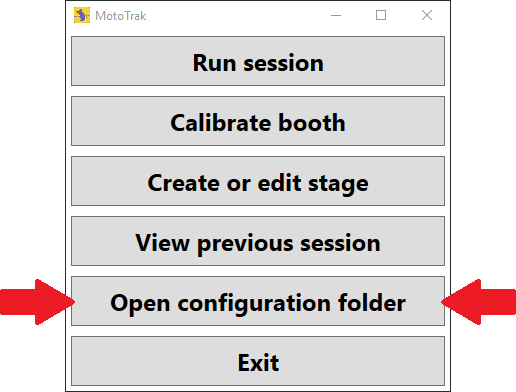

# MotoTrak Sustained Isometric Pull Shaping/Training Example Protocol for Rats

*Updated 2026-01-08*

<ins>**NOTE:**</ins> This protocol is meant to serve as one example of how rats can be trained on the sustained isometric pull task with MotoTrak, but it is by no means the *only* way to train rats. Different labs may use different task parameters, different training steps, different session lengths and frequencies, and different timelines based on their particular models.

--- 

## Stage and Implementation Files:

Stage definition and implementation files, used with the MotoTrak Version 2.0 behavioral program, corresponding to the training/testing stages described in this protocol are hosted and maintained in a public [Github repository](https://github.com/Vulintus/MotoTrak_Example_Protocols). A zip file containing the stage definition and implementation files for this example protocol can also be downloaded from this link:

[Rat Sustained Isometric Pull Example Files - Rat (zip)](https://github.com/Vulintus/MotoTrak_Example_Protocols/raw/main/Sustained%20Pull%20-%20Rat/MotoTrak_Sustained_Pull_Protocol_Rat.zip)

After you unzip the files, you’ll see a folder named “Stages” which contains stage definition files, ending in the extension *.MOTORSTAGE, and you’ll see a Python file called “PythonSustainedPullStageImplementationRat.py”. We’re going to put the two file types in different places.

First, copy/cut all of the *.MOTORSTAGE files and paste them into MotoTrak’s “Stages” folder, which you can get to from the main menu by clicking *Open configuration folder*.

Next, copy/cut the “PythonSustainedPullStageImplementationRat.py” Python file and past it into the following folder (you will likely need administrator permissions on the computer you’re using):

C:\Program Files (x86)\Vulintus\MotoTrak\StageImplementations

If there’s already a file with the same name in the “StageImplementations” folder, go ahead and overwrite it.

…And that’s it! You’re ready to try out this example protocol.

---
 
## General Guidelines:

### Session Length:

30 minutes, twice daily, with a 2+ hour intersession interval.

### Feeding:

Make sure each rat’s home cage food has been removed and that their cage has a completed food restriction card.  Prior to starting training, put half a scoop of Bio-Serv pellets into the rat’s home cage to acclimate them to the food, otherwise they won’t trust the unfamiliar food during their first training session (neophobia). If the rat didn’t receive at least 150 pellets combined across the morning and afternoon sessions, feed the rat two full size home cage food pellets or half a scoop of Bio-Serv/Purina pellets. If you notice rats dropping weight quickly, let your study leader know! At the end of the week (after last session on Friday) all rats should have full feed in their home cages.

### Habituation/Hand Training:

Naive rats should be handled for ~15 minutes each every day for a week after arrival. Handling and hand training can be done on the same days the rats start shaping on MotoTrak behavior.

---

## Training Step 1 (?-? days):

| | |
| :--- | :--- |
| PURPOSE: | Train the rat to sustain an isometric pull for at least 120 milliseconds. |
| STAGE: | PS1 |
| MODULE POSITION: | 1.0 cm (the pull handle will be 1.0 cm outside the cage, measured from the inner wall surface) |
| HIT THRESHOLD: | A pull force of >35 gm for a minimum of 120 ms. |
| DESCRIPTION: | ??? |
| PROGRESSION: | ??? |

---

## Training Step 2 (?-? days):

| | |
| :--- | :--- |
| PURPOSE: | Train the rat to sustain an isometric pull for at least 250 milliseconds. |
| STAGE: | PS2 |
| MODULE POSITION: | 1.25 cm (the pull handle will be 1.25 cm outside the cage, measured from the inner wall surface) |
| HIT THRESHOLD: | A pull force of >35 gm for a minimum of 250 ms. |
| DESCRIPTION: | ??? |
| PROGRESSION: | ??? |

---

## Training Step 3 (?-? days):

| | |
| :--- | :--- |
| PURPOSE: | Train the rat to sustain an isometric pull for at least 370 milliseconds. |
| STAGE: | PS3 |
| MODULE POSITION: | 1.25 cm (the pull handle will be 1.25 cm outside the cage, measured from the inner wall surface) |
| HIT THRESHOLD: | A pull force of >35 gm for a minimum of 370 ms. |
| DESCRIPTION: | ??? |
| PROGRESSION: | ??? |

---

## Training Step 4 (?-? days):

| | |
| :--- | :--- |
| PURPOSE: | Train the rat to sustain an isometric pull for at least 500 milliseconds. |
| STAGE: | PS4 |
| MODULE POSITION: | 1.25 cm (the pull handle will be 1.25 cm outside the cage, measured from the inner wall surface) |
| HIT THRESHOLD: | A pull force of >35 gm for a minimum of 500 ms. |
| DESCRIPTION: | ??? |
| PROGRESSION: | ??? |

---

## Training Step 5 (?-? days):

| | |
| :--- | :--- |
| PURPOSE: | Train the rat to sustain an isometric pull for at least 620 milliseconds. |
| STAGE: | PS5 |
| MODULE POSITION: | 1.5 cm (the pull handle will be 1.5 cm outside the cage, measured from the inner wall surface) |
| HIT THRESHOLD: | A pull force of >35 gm for a minimum of 620 ms. |
| DESCRIPTION: | ??? |
| PROGRESSION: | ??? |

---

## Training Step 6 (?-? days):

| | |
| :--- | :--- |
| PURPOSE: | Train the rat to sustain an isometric pull for at least 750 milliseconds. |
| STAGE: | PS6 |
| MODULE POSITION: | 1.5 cm (the pull handle will be 1.5 cm outside the cage, measured from the inner wall surface) |
| HIT THRESHOLD: | A pull force of >35 gm for a minimum of 750 ms. |
| DESCRIPTION: | ??? |
| PROGRESSION: | ??? |

---

## Training Step 7 (?-? days):

| | |
| :--- | :--- |
| PURPOSE: | Train the rat to sustain an isometric pull for at least 870 milliseconds. |
| STAGE: | PS7 |
| MODULE POSITION: | 1.5 cm (the pull handle will be 1.5 cm outside the cage, measured from the inner wall surface) |
| HIT THRESHOLD: | A pull force of >35 gm for a minimum of 870 ms. |
| DESCRIPTION: | ??? |
| PROGRESSION: | ??? |

---

## Training/Testing Step 8 (?-? days):

| | |
| :--- | :--- |
| PURPOSE: | Train the rat to sustain an isometric pull for at least 1,000 milliseconds. |
| STAGE: | PS8 |
| MODULE POSITION: | 1.5 cm (the pull handle will be 1.5 cm outside the cage, measured from the inner wall surface) |
| HIT THRESHOLD: | A pull force of >35 gm for a minimum of 1,000 ms. |
| DESCRIPTION: | ??? |
| PROGRESSION: | ??? |

---

## Daily Checklist:

* Did you weigh the rat prior to training/testing?
* Are any feeder LEDs blinking red to indicate a feeding error/no pellets?
* Are the feeder tubes properly connected to the feeder and cage?
* Did you spell the rat’s name correctly in the program?
* Is the signal shown on the MotoTrak program showing zero force when none is applied?

## Tips & Tricks:

* Create duplicate training stages with identical parameters, but different descriptions, to organize rats’ sessions according to their progression in the study. For example, you could create a copy of training/testing stage “PS8: Sustained Pull Criterion Testing” and name it “PS9: Post-Lesion Testing” to indicate sessions that occur after an injury model.
